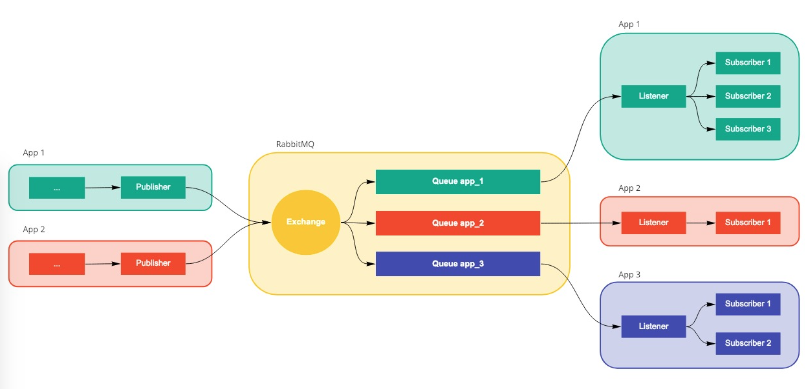

# Domain_events
[](https://travis-ci.org/iPresence/domain_events)

A domain event is something that happened on your application that is interesting for the business.
With this component you will be able to publish an listen to events really easily.

## TL;DR
```yaml
# domain_events.yaml
mapping:
  event_name: Namespace/CustomDomainEvent

rabbit:
  host: 127.0.0.1
  port: 5672
  user: guest
  pass: guest

  exchange:
    name: domain-events
    type: direct

  queue:
    name: domain-events-test
    bindings:
      - event_1
      - event_2
```

```php
$publisher = PublisherBuilder::create()->withYamlConfig('domain_events.yaml')->build();
$listener = ListenerBuilder::create()->withYamlConfig('domain_events.yaml')->build();

$publisher->add($yourDomainEvent);
$publisher->publish();

$listener->subscribe(new YourDomainEventSubscriber());
$listener->listen();
```

## Table of contents
- [Installation](#installation)
- [Usage](#usage)
- [Flow](#flow)
- [Configuration](#configuration)
- [Requirements](#requirements)
- [Compatibility](#compatibility)
- [Development environment](#development-environment)  

## Installation
Require the package as usual
```bash
composer require ipresence/domain_events
```
To use [RabbitMQ](https://github.com/php-amqplib/php-amqplib) as a queue (the default option), you have to **require it manually** 
```bash
composer require php-amqplib/php-amqplib "^2.6"
```

## Usage
### Manually
Publishing
```php
$publisher = PublisherBuilder::create()
    ->withYamlConfig('domain_events.yaml')
    ->build();

$publisher->add($yourDomainEvent);
$publisher->publish();
```

Listening
```php
$listener = ListenerBuilder::create()
    ->withYamlConfig('domain_events.yaml')
    ->build();

$listener->subscribe(new YourDomainEventSubscriber());
$listener->listen();
```

### Symfony
If you are using symfony, the easiest wait is to use it as a bundle, you just need to add `IPresence\DomainEvents\Symfony\DomainEventsBundle::class` in your bundles.php file and this will load the `domain_events.yaml` config located inside `config/packages/`.
At that point you'll have the Publisher and Listener defined in the dependency injection container ready to be used.


## Flow
The currently, we just have RabbitMQ. Here you can see the flowchart:


This library is not only going to create a publisher and listener for you, it will also create the RabbitMQ exchanges and queues so you don't need to worry about that part.

## Configuration
The library allows to build the publisher and the listener from a set configuration values. For example:

```yaml
# domain_events.yaml
mapping:
  event_name: Namespace/CustomDomainEvent

provider:
    rabbit:
      host: 127.0.0.1
      port: 5672
      user: guest
      pass: guest
      vhost: /
    
      exchange:
        name: domain-events
        type: direct
    
      queue:
        name: domain-events-test
        bindings:
          - event_1
          - event_2
    
      consumer:
  
```

* `mapping`: A key-value array with the mapping between domain event names and classes. This is used to deserialize from JSON to PHP objects
* `provider` (**required**): A key-value array with the provider to be used

#### Rabbit configuration values
* `host`: RabbitMQ host (defaults to localhost)
* `port`: RabbitMQ port defaults to (5672)
* `user` (**required**): RabbitMQ user
* `pass` (**required**): RabbitMQ pass
* `vhost`: RabbitMQ vhost to use (defaults to /)
* `exchange`: A key-value array with the exchange configuration
* `queue`: A key-value array with the queue configuration
* `consumer`: A key-value array with the consumer configuration

##### Exchange configuration values
* `name` (**required**): Name of the exchange where the domain events will be published
* `type`: Type of exchange (defaults to direct) 
* `passive`: Will fail if the exchange is already created (defaults to false)
* `durable`: Durable exchange will remain active when server restarts (defaults to true)
* `autoDelete`: Exchange will be deleted when all queues have finished using it (defaults to false)

##### Queue configuration values
* `name` (**required**): Name of the queue where the domain events will be stored before being consumed
* `bindings`: List of domain event names that this queue will store (events that are not in this list will be ignored)
* `passive`: Will fail if the queue is already created (defaults to false)
* `durable`: Durable queue will remain active when server restarts (defaults to true)
* `exclusive`: The queue will be only accessible from the current connection (defaults to false)
* `autoDelete`: Queue will be deleted when all consumers have finished using it (defaults to false)

##### Consumer configuration values
* `noLocal`: RabbitMQ will not send messages to the connection that published them (defaults to false)
* `noAck`: When message will be automatically acknowledged once consumed (defaults to false)
* `exclusive`: Request exclusive consumer access, meaning only this consumer can access the queue (defaults to false)
* `noWait`: RabbitMQ will not respond to the method. The client should not wait for a reply method (defaults to false)


### Requirements
* `php >=7.1`
* `psr/log ^1.0`
* `ramsey/uuid ^3.8`
* `ipresence/monitoring ^1.0`

The library allows to use different queues, an adapter for RabbitMQ is included in the library but you must require the dependency manually
```bash
composer require php-amqplib/php-amqplib "^2.6"
```

#### Logging
Do you want to know why you can't send a domain event or why you are not receiving it? No problem, the library accepts any [Psr-3 logger](http://www.php-fig.org/psr/psr-3/) logger implementation (like [Monolog](https://github.com/Seldaek/monolog)) to write debug and error messages.
You just need to tell the builder that you want to use it.
```php
ListenerBuilder::create()
    ->withYamlConfig('domain_events.yaml')
    ->withLogger($psr3Logger)
    ->build();
```

#### Monitoring
Do you want to know how many domain events are been published or consumed? No problem, the library accepts any monitor that implements this [interface](https://github.com/iPresence/monitoring/blob/master/src/Monitor.php).
You just need to tell the builder that you want to use it.
```php
ListenerBuilder::create()
    ->withYamlConfig('domain_events.yaml')
    ->withMonitor($monitor)
    ->build();
```

### Compatibility
This library has been tested with the following PHP versions and setups

PHP | php-amqplib/php-amqplib | result
--- | ----------------------- | ------
7.1 | 2.8.1 | :white_check_mark:
7.2 | 2.8.1 | :white_check_mark:
7.3 | 2.8.1 | :white_check_mark:

## Development environment
To build the test environment you'll need docker and docker-compose installed:
```
make dev
```

### Running the tests
```bash
make test
```
You can run the tests only for a php version like this
```bash
make unit PHP_VERSION=7.3
```

### Stop the environment
```
make nodev
```

### Delete the environment
You can delete the docker images for a total clean-up
```bash
 make nodev IMAGES=true
```
